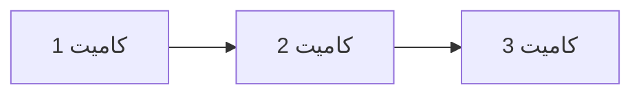

# پورتفولیو React

یک وب‌سایت پورتفولیو شخصی مبتنی بر React برای نمایش مهارت‌های توسعه فرانت‌اند، پروژه‌ها و اطلاعات تماس. این پروژه دارای طراحی پاسخ‌گو، قابلیت تغییر تم روشن/تیره، اجزای متحرک و استقرار در GitHub Pages از طریق GitHub Actions است. تمام فایل‌ها در ریشه مخزن قرار دارند.

## فهرست مطالب
- [بررسی اجمالی پروژه](#بررسی-اجمالی-پروژه)
- [ویژگی‌ها](#ویژگی‌ها)
- [فناوری‌ها](#فناوری‌ها)
- [دستورالعمل‌های راه‌اندازی](#دستورالعمل‌های-راه‌اندازی)
- [استراتژی شاخه‌ها](#استراتژی-شاخه‌ها)
- [استقرار](#استقرار)
- [ساختار دایرکتوری](#ساختار-دایرکتوری)
- [توضیح فایل‌ها](#توضیح-فایل‌ها)
- [سوالات و پاسخ‌های Git (به فارسی)](#سوالات-و-پاسخ‌های-git-به-فارسی)
- [مشارکت](#مشارکت)
- [مجوز](#مجوز)

## بررسی اجمالی پروژه
این پورتفولیو فرانت‌اند استاتیک، ساخته‌شده با React، مهارت‌های توسعه‌دهنده را از طریق صفحه اصلی با بخش هیرو، صفحه درباره، بخش پروژه‌های قابل فیلتر و فرم تماس نمایش می‌دهد. شامل بهینه‌سازی SEO، ویژگی‌های دسترسی و طراحی پاسخ‌گو با قابلیت تغییر تم روشن/تیره است. پروژه از Git برای کنترل نسخه و GitHub Actions برای استقرار خودکار در GitHub Pages استفاده می‌کند. تمام فایل‌ها در ریشه مخزن سازمان‌دهی شده‌اند.

## ویژگی‌ها
- **طراحی پاسخ‌گو**: سازگار با صفحه‌نمایش‌های موبایل، تبلت و دسکتاپ.
- **تغییر تم**: جابجایی بین حالت روشن و تیره با ذخیره در local storage.
- **ناوبری**: نوار ناوبری پاسخ‌گو با منوی همبرگری برای موبایل.
- **انیمیشن‌ها**: انتقال‌های نرم و افکت تایپ با Framer Motion.
- **مسیریابی**: مسیریابی سمت کلاینت با React Router.
- **فیلتر پروژه‌ها**: فیلتر پروژه‌ها بر اساس دسته‌بندی (وب، موبایل، دسکتاپ).
- **SEO**: متا تگ‌ها و favicon برای بهینه‌سازی موتور جستجو.
- **دسترسی**: برچسب‌های ARIA برای سازگاری با صفحه‌خوان‌ها.
- **CI/CD**: استقرار خودکار در GitHub Pages از طریق GitHub Actions.

## فناوری‌ها
- **React**: کتابخانه جاوااسکریپت برای ساخت رابط کاربری.
- **React Router**: برای مسیریابی سمت کلاینت.
- **Framer Motion**: برای انیمیشن‌ها و انتقال‌ها.
- **React Icons**: برای آیکون‌های مقیاس‌پذیر.
- **CSS**: استایل‌های سفارشی با متغیرهای CSS برای تم‌سازی.
- **Git**: سیستم کنترل نسخه.
- **GitHub Actions**: خط لوله CI/CD برای استقرار.
- **GitHub Pages**: میزبانی برای سایت استاتیک.

## دستورالعمل‌های راه‌اندازی
برای اجرای پروژه به‌صورت محلی، مراحل زیر را دنبال کنید:

1. **کلون کردن مخزن**:
   ```bash
   git clone https://github.com/lioneraV2002/SoftwareEngineeringLabHWs.git
   ```

2. **نصب وابستگی‌ها**:
   اطمینان حاصل کنید که Node.js و npm نصب شده‌اند (`node -v`, `npm -v`). سپس:
   ```bash
   npm install
   ```
   این کار وابستگی‌های ذکرشده در `package.json` را نصب می‌کند:
   - `react`, `react-dom`
   - `react-router-dom`
   - `framer-motion`
   - `react-icons`
   - `react-scripts`
   - `@testing-library/*`
   - `gh-pages` (وابستگی توسعه)

3. **پیکربندی Homepage**:
   فایل `package.json` را به‌روزرسانی کنید تا فیلد `homepage` تنظیم شود:
   ```json
   "homepage": '.'
   یا 'https://<username>.github.io/<repo-name>/'
   ```
   برای آدرس دهی از ریشه پروژه یا به صورت دستی با مشخص کردن یوزر و نام مخزن

4. **اجرای محلی**:
   ```bash
   npm start
   ```
   برنامه را در `http://localhost:3000` باز می‌کند.

5. **ساخت برای تولید**:
   ```bash
   npm run build
   ```
   فایل‌های استاتیک را در پوشه `build` تولید می‌کند.

6. **آزمایش استقرار محلی**:
   پوشه build را با سرور محلی اجرا کنید:
   ```bash
   npx serve -s build
   ```

## استراتژی شاخه‌ها
پروژه از سه شاخه استفاده می‌کند:
- **master**: کد آماده تولید، محافظت‌شده برای ادغام فقط از طریق درخواست‌های pull. استقرار در GitHub Pages را فعال می‌کند.
- **dev**: برای توسعه ویژگی‌ها و اجزای جدید.
- **bugfix**: برای رفع اشکالات و مشکلات.

جریان کاری:
- ویژگی‌ها در `dev` توسعه می‌یابند، اشکالات در `bugfix` رفع می‌شوند.
- درخواست‌های pull برای ادغام در `master` ایجاد می‌شوند و نیاز به حداقل یک تأیید دارند.
- شاخه `master` جریان کاری GitHub Actions را برای استقرار فعال می‌کند.

## استقرار
پروژه از طریق GitHub Actions در GitHub Pages مستقر می‌شود.

- **آدرس URL**: `https://<username>.github.io/<repo-name>/`
- **جریان کاری**: تعریف‌شده در `.github/workflows/deploy.yml`.
- **فعال‌سازی**: اجرا در push، درخواست‌های pull ادغام‌شده یا اجرای دستی در شاخه `master`.
- **فرآیند**:
  1. بررسی کد (`actions/checkout@v4`).
  2. تنظیم Node.js (`actions/setup-node@v4`, نسخه 20).
  3. نصب وابستگی‌ها (`npm install`).
  4. ساخت برنامه (`npm run build`).
  5. پیکربندی GitHub Pages (`actions/configure-pages@v5`).
  6. بارگذاری آرتیفکت ساخت (`actions/upload-pages-artifact@v3`, از `build`).
  7. استقرار در GitHub Pages (`actions/deploy-pages@v4`).
- **پیکربندی**:
  - فیلد `homepage` در `package.json` مسیر پایه برای منابع را تنظیم می‌کند.
  - بدون استفاده از فایل `.env`؛ مسیرهای منابع توسط `homepage` مدیریت می‌شوند.

**تأیید**:
- لاگ‌های GitHub Actions را برای موفقیت ساخت بررسی کنید.
- به آدرس URL استقرار مراجعه کنید تا از بارگذاری صحیح سایت اطمینان حاصل کنید.
- اطمینان حاصل کنید که GitHub Pages در تنظیمات مخزن روی شاخه `master` و پوشه `/ (root)` تنظیم شده است.

## ساختار دایرکتوری
```
├── .gitignore
├── package.json
├── public/
│   └── index.html
├── src/
│   ├── App.js
│   ├── App.css
│   ├── index.js
│   ├── context/
│   │   └── ThemeContext.js
│   ├── hooks/
│   │   └── useLocalStorage.js
│   ├── components/
│   │   ├── Navbar/
│   │   │   ├── Navbar.js
│   │   │   └── Navbar.css
│   │   ├── ThemeToggle/
│   │   │   ├── ThemeToggle.js
│   │   │   └── ThemeToggle.css
│   │   ├── Hero/
│   │   │   ├── Hero.js
│   │   │   └── Hero.css
│   │   ├── About/
│   │   │   ├── About.js
│   │   │   └── About.css
│   │   ├── Projects/
│   │   │   ├── Projects.js
│   │   │   ├── Projects.css
│   │   │   ├── ProjectCard.js
│   │   │   └── ProjectCard.css
│   │   ├── Contact/
│   │   │   ├── Contact.js
│   │   │   └── Contact.css
│   ├── styles/
│   │   ├── globals.css
│   │   ├── variables.css
│   │   └── responsive.css
├── .github/
│   └── workflows/
│       └── deploy.yml
```

## توضیح فایل‌ها
در زیر توضیح مفصل هر فایل در پروژه ارائه شده است، شامل فایل‌های ارائه‌شده (`deploy.yml`, `package.json`, `App.js`, `index.js`) و فایل‌های دست‌نخورده که از زمینه قبلی فرض شده‌اند.

- **`.gitignore`**:
  - فایل‌ها و دایرکتوری‌هایی که باید از Git مستثنی شوند (مثلاً `node_modules/`, `build/`) را مشخص می‌کند.
  - تضمین می‌کند که فایل‌های حساس یا تولیدشده کامیت نشوند.

- **`package.json`**:
  - متادیتای پروژه، وابستگی‌ها و اسکریپت‌ها را تعریف می‌کند.
  - **فیلدهای کلیدی**:
    - `"homepage": "."`: مسیر پایه برای منابع (برای GitHub Pages به `https://<username>.github.io/<repo-name>/` به‌روزرسانی کنید).
    - وابستگی‌ها: `react`, `react-dom`, `react-router-dom`, `framer-motion`, `react-icons`, `react-scripts`, کتابخانه‌های تست.
    - وابستگی توسعه: `gh-pages` برای آزمایش استقرار محلی.
    - اسکریپت‌ها: `start`, `build`, `test`, `eject`, `predeploy`, `deploy`.
  - توسط `npm` برای مدیریت وابستگی‌ها و فرآیندهای ساخت استفاده می‌شود.

- **`public/index.html`**:
  - فایل HTML اصلی برای برنامه React.
  - شامل متا تگ‌ها برای SEO (مانند توضیحات، viewport)، favicon و div با `id="root"` برای رندر.
  - شامل لینک Google Fonts برای فونت Vazirmatn.
  - نمونه:
    ```html
    <!DOCTYPE html>
    <html lang="fa" dir="rtl">
      <head>
        <meta charset="utf-8" />
        <link rel="icon" href="%PUBLIC_URL%/favicon.ico" />
        <meta name="viewport" content="width=device-width, initial-scale=1" />
        <meta name="theme-color" content="#000000" />
        <meta name="description" content="پورتفولیو شخصی - توسعه دهنده فرانت اند" />
        <link rel="apple-touch-icon" href="%PUBLIC_URL%/logo192.png" />
        <link rel="manifest" href="%PUBLIC_URL%/manifest.json" />
        <link href="https://fonts.googleapis.com/css2?family=Vazirmatn:wght@300;400;500;600;700&display=swap" rel="stylesheet">
        <title>پورتفولیو شخصی</title>
      </head>
      <body>
        <noscript>برای اجرای این برنامه باید جاوااسکریپت را فعال کنید.</noscript>
        <div id="root"></div>
      </body>
    </html>
    ```

- **`src/App.js`**:
  - کامپوننت اصلی React که ساختار برنامه و مسیریابی را تعریف می‌کند.
  - برنامه را در یک `div` با کلاس `App` قرار می‌دهد، شامل `Navbar` و از `react-router-dom` برای مسیریابی استفاده می‌کند.
  - مسیرها: `/` (Hero), `/about` (About), `/projects` (Projects), `/contact` (Contact).
  - فایل `App.css` را برای استایل وارد می‌کند.

- **`src/App.css`**:
  - استایل‌های ظرف اصلی برنامه و ناحیه محتوا را تعریف می‌کند.
  - نمونه:
    ```css
    .App {
      min-height: 100vh;
      background-color: var(--background-color);
    }
    .main-content {
      margin-top: 70px;
    }
    ```

- **`src/index.js`**:
  - نقطه ورود برنامه React.
  - تنظیم `ReactDOM`, `BrowserRouter` با `basename` پویا (خالی برای تولید، `/react-portfolio` برای توسعه) و `ThemeProvider`.
  - استایل‌های سراسری (`globals.css`, `variables.css`, `responsive.css`) را وارد می‌کند.
  - کامپوننت `App` را در حالت سخت‌گیرانه رندر می‌کند.

- **`src/context/ThemeContext.js`**:
  - زمینه React برای تغییر تم (روشن/تیره) را تعریف می‌کند.
  - از `useLocalStorage` برای ذخیره تم استفاده می‌کند.
  - مقادیر `theme`, `toggleTheme`, و `isDark` را به کامپوننت‌های فرزند ارائه می‌دهد.
  - ویژگی `data-theme` را در `document.documentElement` به‌روزرسانی می‌کند.

- **`src/hooks/useLocalStorage.js`**:
  - هوک سفارشی برای مدیریت حالت در local storage.
  - خواندن، نوشتن و مدیریت خطاها در عملیات local storage را انجام می‌دهد.

- **`src/components/Navbar/Navbar.js`**:
  - نوار ناوبری پاسخ‌گو با لینک‌های به Home، About، Projects و Contact.
  - شامل منوی همبرگری برای موبایل و استایل مبتنی بر اسکرول.
  - از `react-router-dom` برای ناوبری و `react-icons` برای آیکون‌های منو استفاده می‌کند.

- **`src/components/Navbar/Navbar.css`**:
  - نوار ناوبری را با متغیرهای CSS برای تم‌سازی استایل می‌دهد.
  - شامل طراحی پاسخ‌گو برای موبایل (منوی همبرگری) و افکت‌های اسکرول.

- **`src/components/ThemeToggle/ThemeToggle.js`**:
  - کامپوننت دکمه برای جابجایی بین تم‌های روشن و تیره.
  - از `ThemeContext` و `react-icons` (آیکون‌های خورشید/ماه) استفاده می‌کند.
  - شامل برچسب‌های ARIA برای دسترسی.

- **`src/components/ThemeToggle/ThemeToggle.css`**:
  - دکمه تغییر تم را با افکت‌های هاور و رنگ‌های مبتنی بر تم استایل می‌دهد.

- **`src/components/Hero/Hero.js`**:
  - کامپوننت صفحه اصلی با تصویر پروفایل، افکت تایپ متحرک و دکمه‌های فراخوان عمل.
  - از Framer Motion برای انیمیشن‌ها و `react-router-dom` برای لینک‌های ناوبری استفاده می‌کند.

- **`src/components/Hero/Hero.css`**:
  - بخش هیرو را با طراحی پاسخ‌گو، انیمیشن‌ها و رنگ‌های مبتنی بر تم استایل می‌دهد.

- **`src/components/About/About.js`**:
  - صفحه درباره با بیوگرافی، لیست مهارت‌ها و جدول زمانی تجربه.
  - از Framer Motion برای انیمیشن‌ها استفاده می‌کند.

- **`src/components/About/About.css`**:
  - بخش درباره را با چیدمان‌های پاسخ‌گو و پشتیبانی از تم استایل می‌دهد.

- **`src/components/Projects/Projects.js`**:
  - صفحه پروژه‌ها با شبکه قابل فیلتر از پروژه‌ها.
  - کامپوننت‌های `ProjectCard` را نمایش می‌دهد و از فیلتر دسته‌بندی (وب، موبایل) پشتیبانی می‌کند.
  - از Framer Motion برای انتقال‌ها استفاده می‌کند.

- **`src/components/Projects/Projects.css`**:
  - شبکه پروژه‌ها و دکمه‌های فیلتر را با طراحی پاسخ‌گو استایل می‌دهد.

- **`src/components/Projects/ProjectCard.js`**:
  - کامپوننت برای کارت‌های پروژه جداگانه، نمایش عنوان، توضیحات، فناوری‌ها و لینک‌ها (GitHub، دمو).
  - از Framer Motion برای انیمیشن‌های هاور استفاده می‌کند.

- **`src/components/Projects/ProjectCard.css`**:
  - کارت‌های پروژه را با چیدمان‌های پاسخ‌گو و افکت‌های هاور استایل می‌دهد.

- **`src/components/Contact/Contact.js`**:
  - صفحه تماس با فرم و لینک‌های شبکه‌های اجتماعی.
  - از Framer Motion برای انیمیشن‌ها و شامل اعتبارسنجی ورودی است.

- **`src/components/Contact/Contact.css`**:
  - فرم تماس و بخش اطلاعات را با طراحی پاسخ‌گو استایل می‌دهد.

- **`src/styles/globals.css`**:
  - استایل‌های سراسری با بازنشانی CSS، تایپوگرافی و سفارشی‌سازی اسکرول‌بار.
  - از متغیرهای CSS برای تم‌سازی یکپارچه استفاده می‌کند.

- **`src/styles/variables.css`**:
  - متغیرهای CSS برای رنگ‌ها، فونت‌ها و انتقال‌ها (مانند `--primary-color`, `--background-color`) را تعریف می‌کند.
  - از تم‌های روشن و تیره از طریق `[data-theme="dark"]` پشتیبانی می‌کند.

- **`src/styles/responsive.css`**:
  - پرس‌وجوهای رسانه‌ای برای طراحی پاسخ‌گو در دستگاه‌های مختلف.

- **`.github/workflows/deploy.yml`**:
  - جریان کاری GitHub Actions برای ساخت و استقرار در GitHub Pages.
  - در push، درخواست‌های pull ادغام‌شده یا اجرای دستی در شاخه `master` فعال می‌شود.
  - از Node.js 20 استفاده می‌کند، وابستگی‌ها را نصب می‌کند، برنامه را می‌سازد و پوشه `build` را مستقر می‌کند.
  - شامل مجوزهای لازم برای GitHub Pages و از نسخه‌های به‌روز اقدامات (مانند `upload-pages-artifact@v3`) استفاده می‌کند.

## سوالات و پاسخ‌های Git (به فارسی)
در زیر پاسخ‌های مربوط به سوالات Git، همان‌طور که ارائه شده‌اند، به فارسی آورده شده است:

### پوشه‌ی `.git`
مخزن داخلی Git که تمام تاریخچه، تنظیمات و متادیتای پروژه را ذخیره می‌کند.  
**اطلاعات کلیدی**:  
- `HEAD` (اشاره‌گر به کامیت/شاخه فعلی)  
- `objects` (داده‌های باینری کامیت‌ها و فایل‌ها)  
- `config` (تنظیمات اختصاصی پروژه)  
- `refs` (اشاره‌گرهای شاخه‌ها و تگ‌ها)  
**ساخت پوشه**:  
```bash
git init
```

### مفهوم Atomic بودن
**Atomic Commit**:  
- تغییرات به‌صورت **یک واحد تجزیه‌ناپذیر** ثبت می‌شوند  
- یا همه تغییرات commit می‌شوند یا هیچ‌کدام (عدم ثبت نیمه‌کاره)  

**Atomic Pull Request**:  
- هر PR باید **یک وظیفه مستقل** را کامل کند  
- ویژگی‌ها:  
  - بدون شکستن build  
  - قابلیت تست و merge مجزا  

### تفاوت دستورات مدیریت تغییرات
| دستور | کاربرد اصلی |  
|-------|-------------|                                                                               
| `fetch` | دریافت تغییرات از ریموت **بدون ادغام** |  
| `pull` | `fetch` + `merge` (دریافت و ادغام تغییرات) |  
| `merge` | ادغام شاخه‌ها با ایجاد **کامیت جدید** |  
| `rebase` | انتقال کامیت‌ها به نوک شاخه هدف (ایجاد تاریخچه خطی) |  
| `cherry-pick` | کپی کردن **تک کامیت** خاص به شاخه فعلی |  

### تفاوت دستورات بازگردانی
| دستور | کاربرد |  
|-------|--------|  
| `checkout` | سوییچ بین شاخه‌ها/بازگردانی فایل‌ها |  
| `switch` | جایگزین مدرن `checkout` برای سوییچ شاخه |  
| `reset` | بازنشانی کامیت‌ها (حذف از تاریخچه) |  
| `revert` | ایجاد کامیت جدید برای خنثی‌سازی تغییرات |  
| `restore` | بازگردانی فایل‌ها از stage یا کامیت |  

### Stage (Index) و Stash
**Stage/Index**:  
- منطقه میانی بین کدهای ویرایش‌شده و کامیت  
- با `git add` فایل‌ها به stage اضافه می‌شوند  

**`git stash`**:  
- ذخیره موقت تغییرات بدون کامیت  
```bash
git stash      # ذخیره تغییرات
git stash pop  # بازگردانی آخرین تغییرات
```

### مفهوم Snapshot
- تصویر لحظه‌ای از کل پروژه در یک زمان خاص  
- هر کامیت یک **snapshot کامل** از پروژه است  
- کامیت‌ها با اشاره‌گر به اسنپشات والد مرتبط می‌شوند  


### تفاوت Local vs Remote Repository
| ویژگی | Local | Remote |  
|-------|-------|--------|  
| مکان | روی سیستم توسعه‌دهنده | روی سرور (GitHub/GitLab) |  
| کامیت‌ها | بدون نیاز به اینترنت | نیاز به شبکه |  
| دستورات کلیدی | `commit`, `branch` | `push`, `pull`, `clone` |  
| نمونه مسیر | `./.git/` | `https://github.com/user/repo.git` |  

## مشارکت
برای مشارکت:
1. مخزن را فورک کنید.
2. یک شاخه ویژگی ایجاد کنید (`git checkout -b feature/new-feature`).
3. تغییرات را کامیت کنید (`git commit -m "Add new feature"`).
4. به شاخه push کنید (`git push origin feature/new-feature`).
5. یک درخواست pull به شاخه `master` باز کنید.

از `dev` برای ویژگی‌ها و `bugfix` برای رفع اشکالات استفاده کنید. کامیت‌ها باید اتمیک باشند و درخواست‌های pull نیاز به حداقل یک تأیید دارند.

## مجوز
این پروژه تحت مجوز MIT منتشر شده است. برای جزئیات به فایل [LICENSE](LICENSE) مراجعه کنید.

---